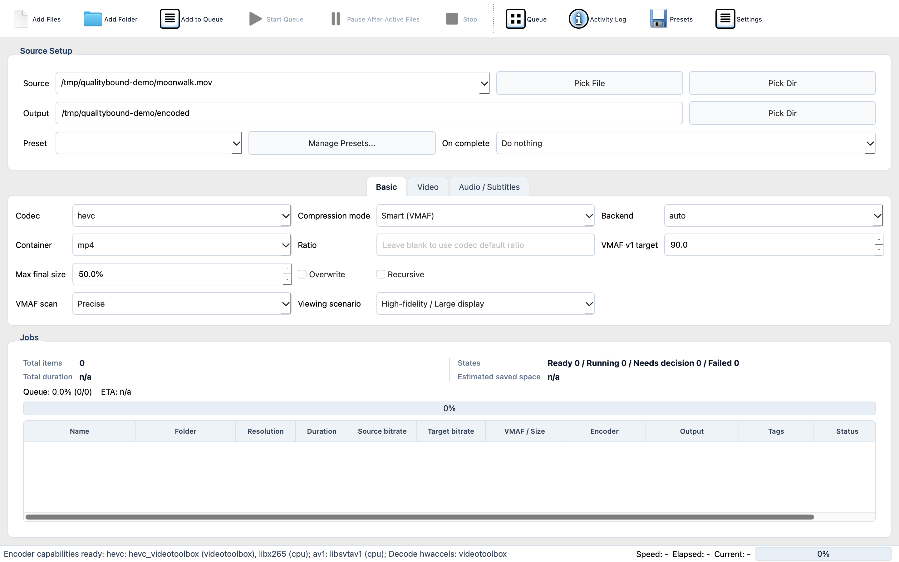

# QualityBound

**Perceptual video compression under explicit quality and size constraints.**

[](https://github.com/starfield17/QualityBound/actions/workflows/ci.yml)
[](https://github.com/starfield17/QualityBound/releases/latest)
[](LICENSE)

QualityBound analyzes a video before encoding, searches for an operating point
that satisfies a perceptual-quality target, and verifies the result on content
that was not used during the search.

Instead of guessing a CRF value, specify the constraints:

```text
VMAF >= 90
output <= 50% of source
```

QualityBound then searches for a viable AV1 or HEVC encode and checks the final
file before publishing it.



## Download

[Download the latest release](https://github.com/starfield17/QualityBound/releases/latest)
for Windows x86-64/ARM64, Linux x86-64/ARM64, or macOS Apple Silicon. Tagged
packages include a compatible FFmpeg and FFprobe build. Assets published before
the QualityBound rename retain their original filenames.

The macOS release is ad-hoc signed rather than notarized. Gatekeeper may require
right-clicking the application and choosing **Open**. Linux packages require a
reasonably recent glibc distribution.

## Why QualityBound exists

CRF is an encoder setting, not a perceptual-quality measurement. The same CRF
can produce very different quality and file sizes on different sources. A fixed
bitrate makes size more predictable, but does not guarantee quality. Repeated
whole-file trial encodes can answer both questions, but at high cost.

QualityBound treats the desired perceptual quality and file size as constraints:

1. Scout scans the timeline for spatial complexity, temporal complexity, and
   scene boundaries.
2. Search windows combine difficult content with coverage across the timeline.
3. Candidate encodes are measured with Netflix VMAF.
4. Separate holdout windows validate the selected bitrate.
5. A failed holdout becomes a search constraint and the search resumes upward.
6. The completed encode is published only after its actual size is validated.

Search and validation windows do not overlap. The samples used to choose a
bitrate are not the same samples used to validate it.

Read [How QualityBound works](docs/algorithm.md) for the measurement and
decision flow, and [Smart evaluation](docs/smart-evaluation.md) for what the
current evidence does and does not establish.

## This is not a general-purpose FFmpeg GUI

QualityBound deliberately does not expose every FFmpeg option. It is designed
around a narrower problem: finding a compact encode that satisfies an explicit
perceptual-quality target.

It does not aim to be a media editor, format-conversion toolbox, or exhaustive
encoder-parameter frontend. Its evidence and validation flow is the product:

- Scout selects windows from scene boundaries, spatial complexity, temporal
  complexity, and timeline strata.
- Search and validation windows are kept separate.
- Failed holdouts are promoted into the search constraints together.
- Size prediction uses measured sample output rather than requested bitrate.
- A completed size miss becomes an explicit decision and cannot overwrite the
  requested output silently.

The desktop GUI makes that workflow accessible, but the constraint and
verification model is the central feature.

## Quick start

Run from a source checkout:

```bash
python -m pip install -r requirements.txt
python main.py
```

Plan or encode from the CLI:

```bash
python main.py --cli plan input.mp4
python main.py --cli encode input.mp4 --backend auto --overwrite
```

The built-in HEVC and AV1 presets use Smart compression by default. The default
minimum is VMAF 90; the default maximum output ratio is 70% for HEVC and 50% for
AV1. Use fixed-bitrate mode explicitly when compatible VMAF filters are not
available:

```bash
python main.py --cli encode input.mp4 \
  --compression-mode fixed_bitrate \
  --ratio 0.76
```

Supported encoding backends are CPU, NVIDIA NVENC, Intel QSV, AMD AMF, and
Apple VideoToolbox where the selected FFmpeg build and hardware expose them.
QualityBound performs runtime encoder smoke tests rather than assuming support
from an encoder name alone.

## Constraint outcomes

QualityBound does not silently publish a result that missed its constraints.

- A predicted quality/size conflict follows the configured Smart policy.
- `ask` leaves the item in **Needs decision** rather than reporting success.
- A completed file that exceeds the size limit is preserved as a size-miss file
  for explicit accept, retry, or delete action; it does not overwrite the target.
- CLI exit code `3` means a decision is required, `2` means analysis or encoding
  failed, and intentional skips remain a successful batch outcome.

Smart measurements are cached as versioned receipts. Quality and size policy
changes may reuse measured candidates; source, FFmpeg, encoder, measurement, or
sample-scheme changes produce a different receipt identity.

## Documentation

- [Algorithm and constraint flow](docs/algorithm.md)
- [Architecture](docs/architecture.md)
- [Development, translations, and packaging](docs/development.md)
- [Evaluation scope and limitations](docs/smart-evaluation.md)
- [Synthetic Smart corpus](docs/smart-corpus.md)
- [CI and release workflows](docs/ci-workflows.md)
- [Release contract map](docs/release-map.md)

## License

QualityBound is released under the [MIT License](LICENSE). Bundled FFmpeg and
Netflix VMAF artifacts retain their own licenses and source/build provenance.
